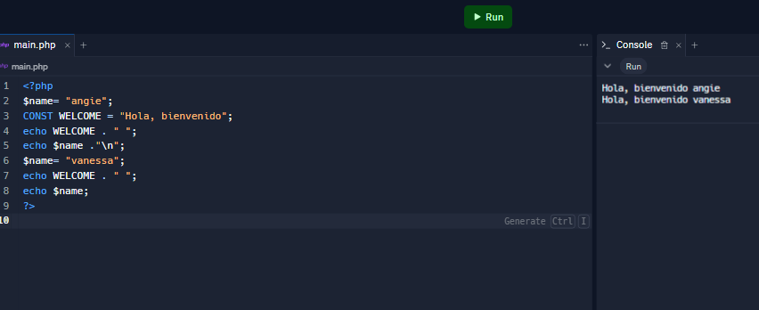
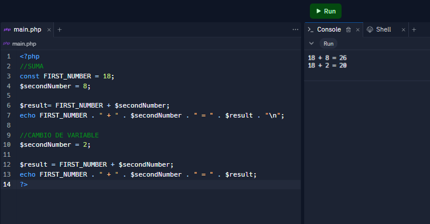
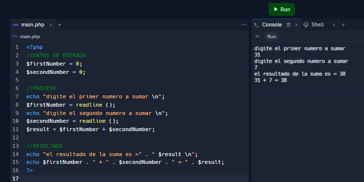
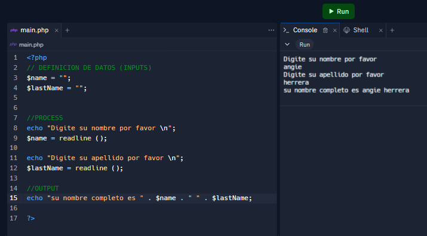
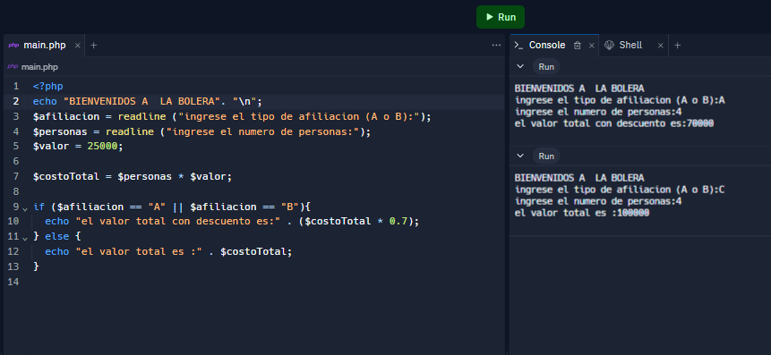
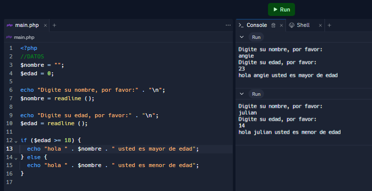
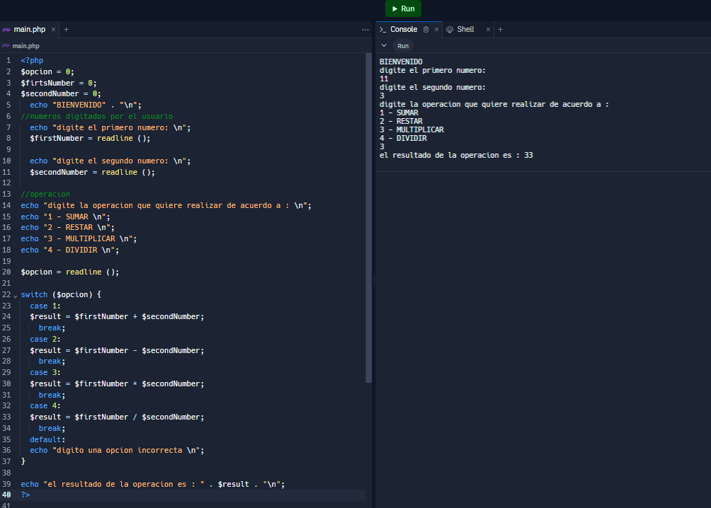

<h1> Taller 10 - Angie Vanessa Herrera Rincon</h1>

<h2> Informacion </h2>

 Curso: Full Stack Basico - Grupo 1 

 Profesor: Cristian Patiño 

<h2> Punto 1: Constantes y Variables</h2>

<h2> Punto 2: Sumas de Constantes y Variables</h2>

<h2> Punto 3: Suma de dos numeros indicados por el usuario</h2>

<h2> Punto 4: Datos del Usuario en consola</h2>

<h2> Punto 5: Entrada a la bolera usando if/else</h2>

<h2> Punto 6: Deteccion de mayoria de edad</h2>

<h2> Punto 7: Seleccion de operacion aritmetica</h2>

<h2> Punto 8: Entrada de bolera usando Switch</h2>

<h2> Punto 9: Tabla de multiplicar usando While</h2>

<h2> Punto 10: Numeros pares usando While</h2>

<h2> Punto 11: Numeros impares usando For</h2>

<h2> Punto 12: Tabla de multiplicar usando For</h2>

<h2> Punto 13: Suma de valores de un arreglo usando for each</h2>

<h2> Punto 14: Revision de contraseña</h2>

<h2> Punto 15: Seleccion de operacion aritmetica usando funciones </h2>